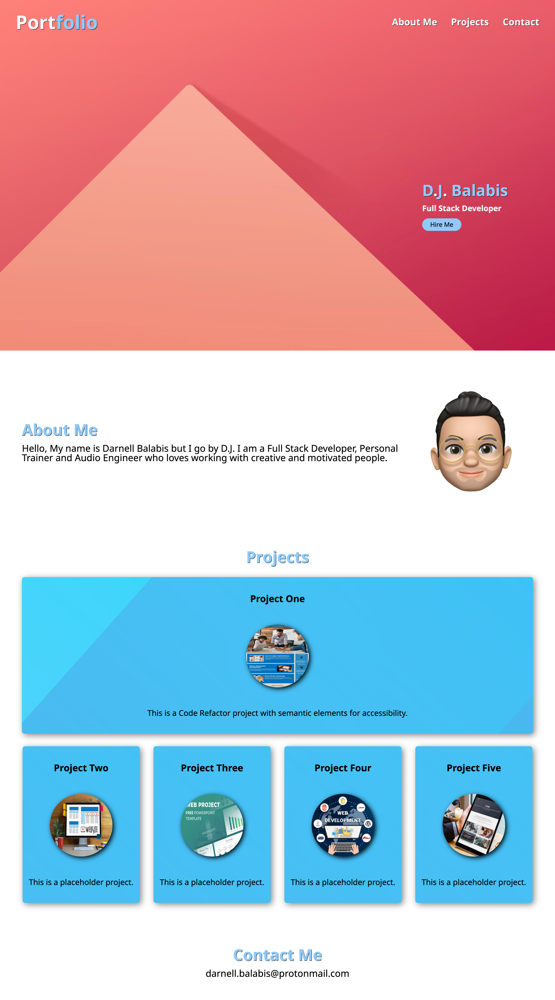

# Professional-Portfolio

## Description

An effective portfolio website is a crucial part in showcasing your skills as a Full Stack Developer. It represents your first impression to any future employers assessing your sample pojects and thought process behind your work. Displaying several live projects on your portfolio will leave a good impression and increase your chances at an initial interview. Keeping your porfolio up to date with your best projects sets you up for future success.

## Mock-up

The following image shows the web application's appearance and functionality:

[Deployed Application](https://djbalabis.github.io/HTML-CSS-Git-Challenge/)